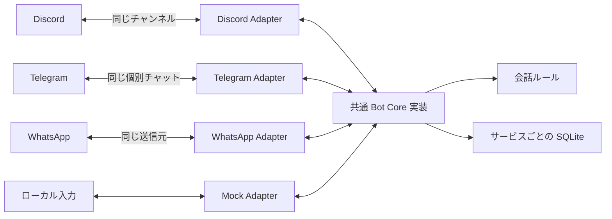

# MultiChannel Bot

**Discord・Telegramなどのチャットサービスで、共通の会話処理を利用できるPython製Bot基盤です。** 問い合わせ受付のデモとアンケートを通じて、API連携・入力検証・会話状態の保存を実装しています。AI支援を活用した自主制作のポートフォリオであり、受託案件の納品実績ではありません。

## 特徴

- サービス固有のAdapterと共通Bot Coreを分離。Discordで受けた投稿は同じDiscordチャンネルへ、Telegramでは同じ個別チャットへ返信します。
- 問い合わせ／アンケート分岐、1〜5の評価、自由記述、入力ミスの再案内、`reset`に対応。
- SQLiteで会話状態と回答を保存し、再起動後も会話を継続。
- 許可ユーザー・チャンネルの制限、WhatsApp署名検証、処理済みメッセージの重複抑制。
- 外部APIやトークンなしで試せるMockデモと、自動テスト131件。

問い合わせは受付文を返すデモです。問い合わせ本文の保存・担当者への通知は未実装です。AI回答生成、管理画面は含みません。アンケート回答のCSV出力はローカルCLIのみ提供します（[CSVエクスポート](#アンケート回答のcsvエクスポート)）。

## 動作確認状況

| 対象 | 確認結果 |
| --- | --- |
| Discord | 2026-09-07に改修版で実送受信・保存・再起動継続を確認。2026-09-08に公開用コードで表示名 MultiChannel Bot、1投稿への同じチャンネルの1返信とDB保存を再確認 |
| Telegram | 同日に改修版で個別チャットへの実返信、評価・コメント保存、再起動後の継続を確認 |
| WhatsApp | 改修版の実接続はMeta復旧後に検証予定。自動テスト・ローカルHTTP検証のみ |
| 自動テスト | 2026-09-08、Python 3.12、既存34件＋異常系7件＝41件成功。2026-09-23、ローカルPython 3.14.6で118件成功（CSVエクスポート29件を含む）。CI（Python 3.12）の結果はPRで確認。同日、PR #16の修正後にローカルPython 3.14.6で131件成功（DBサイドカーへの出力拒否13件を追加）。CI（Python 3.12）の結果はPRで確認 |

Discordの最終確認は公開用コードと既存DBの検証用コピーを用いて実施しました。Telegram・以前の再起動継続は引き継いだ検証記録に基づきます。異常系の追加確認はモックを使った自動テストで、実機障害再現とは区別します。[検証結果と制約](docs/VALIDATION.md)を参照してください。

## アーキテクチャ



共有するのはコードです。実行時は1サービス1プロセス・専用DBを使います。Adapterが入力を`IncomingMessage`へ変換し、Coreが重複判定→会話処理→呼び出し元Adapterで返信→DB更新を行います。横断転送、一斉配信、サービス間の会話共有・アカウント統合は実装しません。

`adapters/`は各サービスとの接続、`core/bot.py`は共通処理、`conversation.py`は会話ルール、`database.py`は永続化を担当します。LINEなどへの拡張時も受信元に返信するAdapter・専用DB・テストを追加する構成です。LINE Adapter自体は未実装です。

## セットアップ

Python 3.12 / PowerShellで、プロジェクトフォルダから実行します。

```powershell
py -3.12 -m venv .venv
.\.venv\Scripts\python.exe -m pip install -r requirements.txt
.\.venv\Scripts\python.exe -m unittest discover -s tests -v
.\.venv\Scripts\python.exe tools/smoke_test.py
.\.venv\Scripts\python.exe run_bot.py mock
```

Mockでは`reset` → `2` → `9`（入力エラー）→ `5` → `使いやすかった`を入力します。続いて`1` → `料金を知りたい`で受付デモを確認できます。`/quit`で終了。`2`の後に終了・再起動して`5`を入力すると状態の継続を確認できます。MockのDBは`data/mock.db`です。

外部サービスを使う場合は`.env.example`を`.env`にコピーし、PC内で必要項目を編集してください。既存の`.env`は上書きしません。**`DRY_RUN`はWhatsApp専用です。Discord・Telegramは起動すると実返信します。**

### アンケート回答のCSVエクスポート

保存済みのアンケート回答をCSVへ書き出します。プロジェクトフォルダから実行します。

```powershell
.\.venv\Scripts\python.exe tools/export_feedback.py --db data/mock.db --output exports/feedback.csv
```

- 出力列は`rating`、`comment`、`updated_at`です。`sender_key`などの識別子・生のユーザーIDは出力しません。
- 文字コードはUTF-8（BOM付き）です。`updated_at`はUTCです。コメント未入力の回答も`comment`空欄で出力します。回答0件でもヘッダー行を出力します。
- `=`、`+`、`-`、`@`（全角を含む）、タブ・改行で始まる値は、表計算ソフトで数式として解釈されないよう先頭に`'`を付けます。
- DBは読み取り専用で開き、変更しません。出力先フォルダがなければ作成します。
- 出力先に既存ファイルがある場合はエラーで終了します。上書きする場合は`--force`を付けます。DBと同じパスへの出力はできません。`--force`を付けても、DBのジャーナル等（`<DB>-journal`、`<DB>-wal`、`<DB>-shm`）へは出力できません。
- 失敗時は`Error: ...`を表示し、終了コード1で終了します。回答本文はエラー表示に含めません。

### Discord

1. [Developer Portal](https://discord.com/developers/applications)で対象Botを選び、表示名を[名前統一手順](docs/DISCORD_NAME.md)に沿って設定。
2. BotのMessage Content Intentを有効化。OAuth2の`bot`スコープでテストサーバーに招待し、対象チャンネルのView Channel・Send Messagesを許可。
3. `.env`の`DISCORD_BOT_TOKEN`、`DISCORD_ALLOWED_USERS`、`DISCORD_ALLOWED_CHANNELS`を設定。IDはDiscord開発者モードでコピーし、複数はカンマ区切り。
4. `DISCORD_DATABASE_PATH=data/discord.db`を使い、次を実行。

```powershell
.\.venv\Scripts\python.exe -m pip install -r requirements-discord.txt
.\.venv\Scripts\python.exe run_bot.py discord
```

通常テキストチャンネルで利用します。Bot投稿・許可外ユーザー・許可外チャンネルは無視します。送信失敗時は状態を進めませんが、自動再配信はしません。権限や通信を復旧して、新しいメッセージで再入力してください。

### Telegram

1. BotFatherの`/newbot`でBotを用意し、`TELEGRAM_BOT_TOKEN`を設定。
2. 自分の数値ユーザーIDを`TELEGRAM_ALLOWED_USERS`に設定（複数はカンマ区切り）。
3. `TELEGRAM_DATABASE_PATH=data/telegram.db`を使います。既存Webhookがある場合は、pollingへ切り替える前にBot APIの`deleteWebhook`で解除。
4. 次を起動し、Botとの個別チャットで`/start`を送信。

```powershell
.\.venv\Scripts\python.exe run_bot.py telegram
```

個別チャットの許可ユーザーだけを処理します。グループとBot投稿は対象外です。通信失敗時はプロセスが終了します。接続を復旧して再起動してください。失敗した更新は処理済みにせず、次の取得で確認済み扱いに進めません。ただしTelegramの更新保持期間を超える再取得はできません。

### WhatsApp（Meta復旧後）

元プロジェクトの設定やDBは変更せず、このコピー専用の設定・DBを用意します。

1. Meta側でテスト環境・受信番号を準備し、`.env`の`VERIFY_TOKEN`、`META_APP_SECRET`、`WHATSAPP_PHONE_NUMBER_ID`、`TEST_ALLOWED_SENDERS`を設定。
2. `DATABASE_PATH=data/messages.db`、`DRY_RUN=true`から開始。
3. `app.py`を起動し、別途用意したHTTPS公開先の`/webhook`をMetaへ登録。messagesを購読。
4. 実送信検証時に`WHATSAPP_ACCESS_TOKEN`とMetaのAPI Setupに表示された`GRAPH_API_VERSION`を設定し、`DRY_RUN=false`へ変更。

```powershell
.\.venv\Scripts\python.exe app.py
# 同じ起動経路: .\.venv\Scripts\python.exe run_bot.py whatsapp
```

ローカル待受は`127.0.0.1:8000`です。`GET /health`、検証用`GET /webhook`、署名検証付き`POST /webhook`を提供します。常設ホスティングは含みません。

## プライバシー方針

- メッセージは会話処理に使用し、返信先と返信文を受信元サービスのAPIへ送ります。他のチャットサービス・外部AIへの送信は実装していません。
- DBに会話状態、ユーザー識別子と処理済みIDのハッシュ、評価、自由記述、処理・回答の時刻を保存します。問い合わせ本文と受信ペイロード全体は保存しません。
- ハッシュ化は匿名性を保証せず、DBの暗号化も実装していません。自由記述には個人情報が含まれ得るため、デモには架空の内容を使ってください。
- DB・ログ・トークン・許可IDは公開しません。アプリの通常ログは本文・生のID・トークンを含めない設計です。外部プロキシやデバッグログは別管理が必要です。
- Discordの投稿と返信はそのチャンネルの閲覧者に見えます。テスト用の閲覧範囲を設定してください。
- 自動保存期限・完全削除APIは未実装です。`reset`は該当会話の回答を削除しますが、処理済みIDやバックアップの完全削除ではありません。運用開始前に保存期間・削除窓口を定めてください。
- CSVエクスポートした自由記述には個人情報が含まれ得ます。既定の出力先`exports/`はgit管理外ですが、CSVを公開・共有せず、不要になったら削除してください。数式対策は主要な表計算ソフトでの誤実行を防ぐためのもので、すべての利用環境での安全を保証しません。

## 制約

同一サービス・同一DBは1プロセスで実行してください。サービス間のDBパス重複は自動検出しません。送信成功後〜DB保存前の停止やタイムアウトでは再試行で重複送信が起こり得ます。厳密な一度だけの配送、再試行キュー、本番運用・負荷試験は対象外です。

## 関連資料

- [検証結果](docs/VALIDATION.md)
- [Discord表示名の統一](docs/DISCORD_NAME.md)
- [公開前の確認とGitHub候補](docs/PUBLISHING.md)
